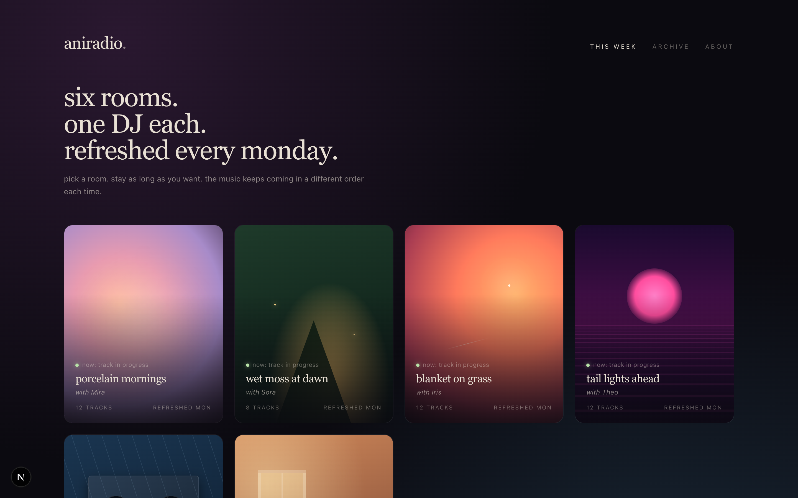

# aniradio

> Six AI-hosted radio rooms. One DJ each. Refreshed every Monday.

A web app where you pick a vibe — *bedroom pop, lofi study, forest at dusk, late drive, sunday kitchen, golden hour park* — and step into a room where a distinct AI DJ introduces tracks they "wrote" for you. The music is real audio, generated by Google's **Lyria 3 Pro**. The narration is real voice, synthesized by **Chirp 3 HD** (and soon, ElevenLabs voice clones).



---

## What's in the box

Six fully-generated rooms, ready to play:

| Room | DJ | Genre slice | Tracks |
|---|---|---|---|
| **bedroom pop** — *porcelain mornings* | Mira | dream pop / acoustic / felt piano | 12 |
| **lofi study** — *late draft* | Yui | chillhop / ambient piano / lofi | 12 |
| **forest at dusk** — *wet moss at dawn* | Sora | ambient drone / soft pad | 8 |
| **late drive** — *tail lights ahead* | Theo | synthwave / outrun / chillwave | 12 |
| **sunday kitchen** — *toast and tea* | Wren | bossa nova / 60s french / soft jazz | 12 |
| **golden hour** — *blanket on grass* | Iris | indie pop / breezy folk | 12 |

Total: **68 Lyria 3 Pro tracks** + **84 Chirp 3 HD DJ intros**. ~110 minutes of music across the six rooms. Every track has both a song and an intro — 100% generation coverage.

## How a room plays

```
step into the room
        │
        ▼
  ┌──────────────┐
  │  DJ intro    │  ← Chirp 3 HD voice
  │  (~15s)      │
  └──────┬───────┘
         ▼
  ┌──────────────┐
  │ ~2-min song  │  ← Lyria 3 Pro audio
  └──────┬───────┘
         ▼
  ┌──────────────┐
  │  DJ intro    │
  │  (next song) │
  └──────┬───────┘
         ▼
        ...
```

Channel mode: the player rotates through the deep pool of generated tracks. Each visit lands on a different starting point. Skip / pause / restart controls. The next two upcoming tracks are visible in the ticker so you can decide whether to stay.

## Architecture

```
┌──────────────────────────────────────────────────────┐
│                AUTHORING (weekly)                    │
│                                                      │
│  spaces/<room>/week-YYYY-MM-DD.json                 │
│    │  human-authored track list                      │
│    │  (titles, artists, music prompts, dj hints)    │
│    │                                                 │
│    ▼                                                 │
│  node scripts/generate-space.mjs                    │
│    ├─ Gemini 3 Flash → writes DJ scripts            │
│    ├─ Lyria 3 Pro   → generates 2-min songs         │
│    └─ Chirp 3 HD    → synthesizes DJ voice          │
│         │                                            │
│         ▼                                            │
│  public/spaces/<room>/<week>/                        │
│    manifest.json + *.mp3 (static files)             │
└──────────────────────────────────────────────────────┘

┌──────────────────────────────────────────────────────┐
│                  RUNTIME (per visit)                 │
│                                                      │
│  Next.js · App Router                                │
│  Lobby reads all manifests, links to rooms.         │
│  Channel player streams the static mp3s in order,   │
│  controls + per-room <Scene /> for visual identity. │
│  No live API calls. No backend service.             │
└──────────────────────────────────────────────────────┘
```

## Visual identity per room

Each room has its own scene component — not just a palette swap. Different "playing objects," different DJ presences, different ambient effects.

- **bedroom pop** — spinning vinyl with peach/lavender label, Mira aurora orb
- **lofi study** — cassette tape with two reels, rain on the window, Yui's warm desk-lamp glow
- **forest at dusk** — three-layer treeline silhouette, drifting fireflies, Sora's lantern wandering through the trees, faint waveform near the ground
- **late drive** — neon sun at the horizon, scanlined, perspective-grid freeway rushing forward, car-radio LCD deck with Theo's "ON AIR" indicator
- **sunday kitchen** — sunlit window with dust particles, vintage AM/FM kitchen radio, Wren's oven-light glow
- **golden hour** — low sun lens flare, picnic blanket on grass, portable boombox, Iris's bright warm orb

You can also preview the design system at `/mocks/lobby.html`, `/mocks/space-lofi.html`, `/mocks/space-forest.html`, `/mocks/space-late-drive.html` — the same atmospheres rendered as static HTML.

## Quickstart

### Prerequisites

- Node 20+
- A Google Cloud project with **Vertex AI** (Gemini + Lyria 3) and **Cloud Text-to-Speech** APIs enabled
- `gcloud auth application-default login` set up

### Run the app

```bash
git clone https://github.com/YOUR_USERNAME/aniradio.git
cd aniradio
npm install
npm run dev
# → http://localhost:3000
```

The repo ships with one week of pre-generated audio (~195 MB across all 6 rooms), so the app plays out of the box without you needing to call any generation APIs.

### Generate a new week

```bash
# Edit spaces/<room>/week-YYYY-MM-DD.json with your track list,
# then run the pipeline:
node scripts/generate-space.mjs --space bedroom-pop --week 2026-05-26
```

The script generates all assets in parallel (~60–110s per room depending on track count). The frontend auto-picks the most recent week per room and rotates previous weeks into the archive.

### Useful flags

| Flag | What it does |
|---|---|
| `--only 03,07` | Regenerate just these track ids and merge into the existing manifest |
| `--resynth-voice` | Re-run Chirp on the existing DJ scripts (use when you change `speaking_rate` or voice id; ~1 second per room) |
| `--skip-music` | Skip Lyria calls (useful for testing voice) |
| `--skip-voice` | Skip Chirp calls (useful for testing prompts) |
| `--limit 1` | Generate just the first N tracks (smoke test) |

## Per-DJ tuning

Each room's `week-*.json` has a `dj` block:

```json
"dj": {
  "name": "Mira",
  "voice": "en-US-Chirp3-HD-Leda",
  "speaking_rate": 0.85,
  "persona": "a quiet friend at midnight..."
}
```

- `voice` — Chirp 3 HD voice name (8 voices: Aoede, Puck, Charon, Kore, Fenrir, Leda, Orus, Zephyr). Will accept ElevenLabs `voice_id` strings once the ElevenLabs engine lands.
- `speaking_rate` — 0.25–4.0. 0.82 (Sora's near-meditation pace) → 0.92 (Iris's bright but slowed delivery). Default 0.9.
- `persona` — system prompt fragment Gemini uses when writing this DJ's intros.

## Project structure

```
app/
  page.tsx              lobby (reads all manifests from disk)
  spaces/[slug]/        per-room page
components/
  ChannelPlayer.tsx     playback engine, controls, channel ticker
  scenes/               per-room visual identity (6 scenes)
  LobbyCard.tsx         mini-scene previews for the lobby
lib/
  channel-types.ts      shared types
public/
  mocks/                static HTML design mocks for each room
  spaces/<slug>/<week>/ generated audio + manifest (one week per room shipped)
scripts/
  generate-space.mjs    Gemini + Lyria + Chirp pipeline
  screenshots.mjs       README screenshot capture (puppeteer-core)
spaces/<slug>/
  week-YYYY-MM-DD.json  human-authored track list (editor's surface)
```

## Models

| Job | Model | Where it runs |
|---|---|---|
| Episode plan + DJ scripts | `gemini-3-flash-preview` | Vertex AI, location=global |
| Music (~2-min songs) | `lyria-3-pro-preview` | Vertex AI, location=global, `responseModalities: ["AUDIO", "TEXT"]` required |
| DJ narration | `en-US-Chirp3-HD-{voice}` | Cloud Text-to-Speech, REST transport (`fallback: true` for Next.js compatibility) |

Default Google Cloud project ID: `neon-emitter-458622-e3` (override with `GOOGLE_CLOUD_PROJECT` in `.env.local`).

## Lyria safety filter — patterns to avoid in prompts

The filter is real and worth knowing. Reliable triggers across our ~140 generation attempts:

| ❌ Hard blocks | ✅ Works instead |
|---|---|
| Real artist names (even "in the spirit of X") | Generic genre + style descriptors |
| "whispered/breathy/layered female vocals" | "Instrumental only, no vocals" + describe instruments |
| "vinyl crackle" / "tape hiss" / "dusty crackle" | "warm lo-fi production" / "warm analog production" |
| "distant cicadas" / "dawn birdsong" / "footsteps on leaves" / "running water" | "high-pitched synth shimmer evoking [thing]" / named chord progressions |
| 4–5 minute pieces with "no rhythm" | Shorten to ~2 min and add "very minimal soft brushed percussion" |

## Roadmap

- [ ] **ElevenLabs voice upgrade.** Per-DJ voice clones for "soothing & charming" delivery beyond what Chirp's optimized-for-clarity model offers.
- [ ] **Archive weeks UI.** Browse and play prior weeks per room.
- [ ] **Mobile layouts.** Player is desktop-first today.
- [ ] **Listener telemetry.** Anonymous "who's in which room" indicator on the lobby cards (the green pulse is currently static).
- [ ] **More rooms.** Easy to add: author a new `spaces/<slug>/week-*.json`, write a `<Scene />` component, drop it in `SCENES`.

## License

MIT. See [LICENSE](LICENSE).

## Credit

Built by [Annie](https://github.com/) with [Claude](https://claude.ai). Music by Lyria 3 Pro. Voices by Chirp 3 HD.

The DJs are imaginary. The songs are not real but they're real audio. The artists and album titles are invented by Gemini and exist only inside aniradio.
